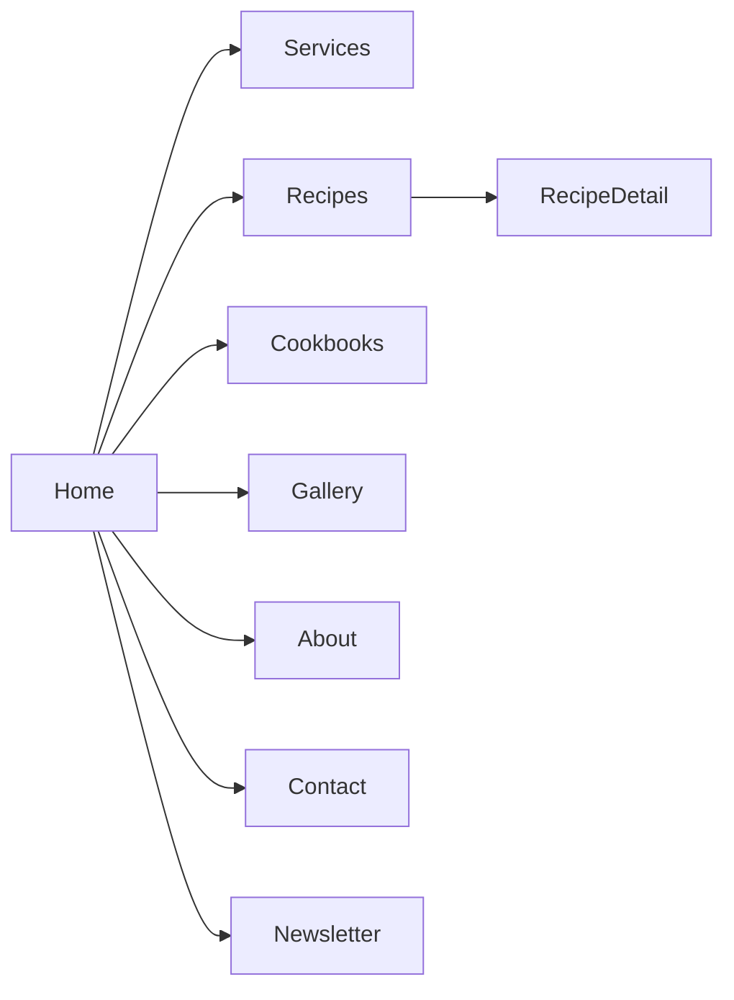

# The Gut Filling — Website Roadmap

Date: 2025-09-17
Prepared for: The Gut Filling (Houston, TX)
Prepared by: [Your Name]

---

## 1) Project Summary
The Gut Filling has a strong social presence (Instagram + Facebook) but no owned website. The website will turn your audience into inquiries, bookings, cookbook buyers, email subscribers, and repeat fans. We’ll build a fast, trustworthy, and SEO-optimized site that feels like your brand from day one and can scale later.

- Core outcomes
  - Ownable online home on your domain
  - Local SEO visibility for Houston food searches
  - Simple way to book, inquire, or join the newsletter
  - Foundation to sell cookbooks/merch later
  - Easy content management and analytics

- Success metrics
  - First 90 days: 1) time-on-site > 1:30, 2) bounce rate < 55%, 3) at least 20 qualified inquiries/subscribers, 4) site speed: Core Web Vitals green on mobile/desktop.

---

## 2) Brand Cues (from your logo and feeds)
- Personality: warm, foodie, community-first, evidence-based but approachable
- Visual direction
  - Colors
    - Gut Red: #E11D48 (primary accents and buttons)
    - Charcoal: #111827 (headings/body on light backgrounds)
    - Warm Cream: #FFF7ED (section backgrounds)
    - Slate: #334155 (secondary text/dividers)
    - Mint Accent: #10B981 (success, highlights)
  - Typography
    - Headings: Poppins (600/700)
    - Body: Inter (400/500)
  - Imagery: bright natural light, close-up plating, occasional process shots. Prefer 3:2 or 4:3 crops for hero and blog covers.

Accessibility note: maintain AA contrast on text vs background, especially red on cream; use dark text on light backgrounds for paragraphs.

---

## 3) Sitemap and Key Pages
- Home
  - Above the fold: value proposition, Houston location badge, CTA: "Book tasting" + "Get 5 free recipes" (lead magnet)
  - Social proof (IG highlights, testimonials), featured recipes, cookbook promo, newsletter form
- Menu / Services
  - Sections for: Pop-ups, Catering, Private Dinners/Classes; simple price ranges + inquiry CTA
- Recipes / Blog
  - Categories (Salads, Mains, Desserts, Drinks), schema.org Recipe, print-friendly view
- Cookbooks
  - Feature 2023/2024/2025 editions; sample pages; buy links (present or future)
- Gallery
  - Curated images + optional Instagram feed
- About
  - Story, philosophy, values; Houston map pin
- Contact / Booking
  - Form with event details, optional Calendly embed, location, email, socials
- Newsletter
  - Lead magnet delivery page + subscribe form
- Press / Media Kit (optional)
- 404 + Legal (Privacy, Terms)

---

## 4) Feature Set
- High-performance, responsive site (mobile-first)
- Forms: booking/inquiry with email notifications
- Newsletter integration (ConvertKit/Mailchimp)
- Recipe content type with rich metadata + JSON-LD
- Instagram feed embed (server-side cached)
- SEO and social share images per page
- Analytics: GA4 + Vercel Analytics
- Optional: Stripe checkout for digital cookbook or merch

---

## 5) Tech Stack (modern, proven)
- Framework: Next.js 15 (App Router) + TypeScript
- Styling: Tailwind CSS + Framer Motion (subtle micro-interactions)
- Database: PostgreSQL (Neon or Supabase) via Prisma ORM
- Image delivery: Vercel Images + optional Cloudinary
- Email: Resend (or SendGrid) for form notifications
- Auth (future): NextAuth if needed for customer portal
- Hosting: Vercel (global CDN, SSL, previews)

Why this stack: instant performance, easy previews for approvals, and future-proof content models. Fits your current folder `Nextjs, Prisma Orm, postgresql/` nicely.

---

## 6) Content & Data Models (initial)
- Recipe: id, slug, title, heroImage, description, ingredients[], steps[], prepTime, cookTime, tags[], nutrition, publishedAt, author
- Post (for general blog): id, slug, title, coverImage, excerpt, body, tags[], publishedAt
- Cookbook: id, year, title, coverImage, description, price, buyUrl
- Page: id, slug, title, blocks (hero, text, gallery, CTA)
- Testimonial: id, name, quote, source, avatar
- Media: id, url, alt, width, height
- Inquiry: id, name, email, phone?, eventType, headcount, date, message, createdAt

---

## 7) SEO & Local Discoverability
- Keyword themes: "Houston catering", "pop-up dinners Houston", "healthy recipes Houston", brand: "The Gut Filling"
- Structured data: Organization, LocalBusiness, Recipe, Article
- On-page: semantic headings, fast LCP, proper alt text
- Local: Google Business Profile (sync NAP), embed map on Contact
- Social OG: custom OG image per article/recipe/cookbook

---

## 8) Deliverables
- Fully responsive website on your domain (Vercel-hosted)
- Content models + seed examples (recipes, posts)
- Inquiry/booking form with email notifications
- Performance + accessibility pass (Lighthouse + axe)
- SEO baseline (metadata, sitemaps, robots, schema)
- Admin docs + a 20–30 min handover video
- 30 days of launch support

---

## 9) Timeline (typical)
- Week 0 — Kickoff
  - Accept Fiverr offer, share assets (logo SVG/PNG, brand notes, hero images, bio, services, cookbook info)
- Week 1 — UX/Design
  - Wireframes and visual direction; 1 round of revisions
- Weeks 2–3 — Build
  - Component development, CMS/schema, forms, integrations
- Week 4 — Content, QA, SEO
  - Populate pages, speed hardening, accessibility review, pre-launch checklist
- Week 5 — Launch
  - DNS go-live, analytics, training video, support window starts

Expedite option (+25%) can compress to ~3 weeks total.

---

## 10) Packages (guidance)
- Starter ($600–$900)
  - 1–3 pages (Home, Contact, About), inquiry form, IG embed, SEO baseline
- Growth ($1,200–$2,000)
  - 5–7 pages, Recipes/Blog, CMS, newsletter, performance hardening
- Pro ($2,500–$4,500)
  - 8–12 pages, store/checkout, bookings, media kit, advanced SEO

Add‑ons: monthly care plan, new sections, landing pages, copywriting, photography, email setup.

---

## 11) Project Management & Communication
- Primary channel: Fiverr messages for transparency and protection
- Weekly update cadence + preview links per milestone
- Version control: Git with Vercel preview deployments per commit

---

## 12) Payment & Milestones (via Fiverr)
- Milestone 1 (20%): Discovery + wireframes delivered as PDF/links
- Milestone 2 (40%): Dev preview on Vercel with core pages and components
- Milestone 3 (30%): Content populated, QA passed, pre-launch signoff
- Milestone 4 (10%): Launch + handover video + 30-day support

You’ll receive a single Fiverr Custom Offer with these milestones. Payments are held in escrow by Fiverr for safety.

---

## 13) Launch Checklist (partial)
- ✅ Domain connected to Vercel
- ✅ 301/404 configured, robots/sitemap generated
- ✅ OG images and favicons set
- ✅ Forms tested (success + failure states)
- ✅ Lighthouse (mobile/desktop) green; axe scan clean
- ✅ GA4 + Vercel Analytics recording

---

## 14) What I need from you
- High‑res logo (SVG/PNG), brand color notes, any font files if applicable
- 6–10 hero images, 12–18 gallery images (or permission to curate from IG)
- Services/menu blurbs and any starting price ranges
- Short bio, Houston locality notes, contact email/phone for the form
- Cookbook details (images, buy links, years, pricing)

---

## 15) Next Steps
1) Reply “Yes, let’s go” and choose a package
2) I’ll send a Fiverr Custom Offer with the milestones above: [Your Fiverr Profile URL]
3) Share assets via Fiverr after order starts
4) Approve wireframes, then I build and iterate with you on previews

Optional: we can jump on a quick 15‑minute call first if you prefer; I’ll still send the Fiverr offer so everything stays secure.

---

Questions welcome! I’ll tailor the scope if you’d like to start smaller or add e‑commerce later.
